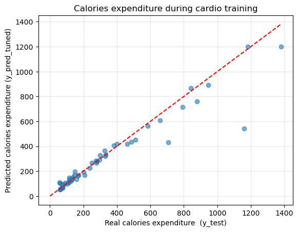

# End-to-End ML: Calorie Expenditure Prediction

This repository contains the complete machine learning pipeline for a project focused on predicting **calorie expenditure** from human activity data. This project demonstrates key skills in data processing, robust feature engineering, model evaluation, and MLOps practices.

## 🎯 Project Goal

The primary objective is to build a reliable regression model that accurately predicts the number of calories a person burns based on sensor data or recorded activity features. This type of model is fundamental to fitness trackers, health applications, and personalized wellness platforms.

**Problem:** Accurately estimating calorie burn is complex, as it depends on activity type, intensity, duration, and personal biometrics.
**Solution:** A data-driven approach using machine learning to learn these complex patterns from a labeled dataset.

-----

## 🛠️ Tech Stack

  * **Core Libraries:** Python, Pandas, NumPy, Scikit-learn
  * **Data Analysis & Experimentation:** Jupyter Notebooks
  * **Data Visualization:** Matplotlib, Seaborn
  * **Model Persistence:** joblib

-----

## 🚀 Project Pipeline

This project follows a structured, end-to-end machine learning workflow, with each major step containerized in its own notebook for clarity and reproducibility.

### 1\. Data Preprocessing (`preprocessing.ipynb`)

  * **Data Loading:** Ingested raw activity data from Garmin Expix Gen2 watch.
  * **Cleaning:** Handled missing values (e.g., using median) and corrected data types.
  * **Exploratory Data Analysis (EDA):** Analyzed feature distributions, and relationships between variables, and identified outliers.

### 2\. Feature Engineering (`feature_engineering.ipynb`)

This is the most critical phase for model performance. New, informative features were created from the raw data, including:

  * **Time-based Features:** `elapsed_time`
  * **Interaction Features:** `avg_speed, avg_distance`
  * **Statistical Features:** `burned_calories_per_minute`
  * **Categorical Encoding:** `One-hot encoding for 'activity_type`

### 3\. Model Training & Evaluation (`model_training_and_evaluation.ipynb`)

  * **Model Selection:** Systematically trained and evaluated several regression algorithms:
      * Linear Regression
      * Random Forest Regressor
  * **Evaluation Metrics:** Assessed models using **R-squared (R²)** and **Root Mean Square Error (RMSE)**.
  * **Hyperparameter Tuning:** Utilized `GridSearchCV` on the top-performing models to optimize their predictive power.

-----

## 📈 Results & Key Findings

The final model, a **Hypertuned Random Forest Regressor**, achieved the following performance on the hold-out test set:

  * **R-squared (R²):** 0.90
  * **RMSE:** 101.49 calories

A **Feature Importance** analysis revealed that distance and burned_calories_per_minute were the most significant predictors of calorie expenditure.


Predicted vs. Actual calories burned scatter plot.  


-----

## 🔩 Project Structure

```
activities_ML_project/
│
├── .gitignore
├── final_calorie_prediction_model.pkl    # The final, serialized model
├── preprocessing.ipynb                   # Notebook for data cleaning and EDA
├── feature_engineering.ipynb             # Notebook for creating new features
├── model_training_and_evaluation.ipynb   # Notebook for model comparison and tuning
├── requirements.txt                      # All project dependencies
└── src/
    └── features.py                       # For helper functions
```